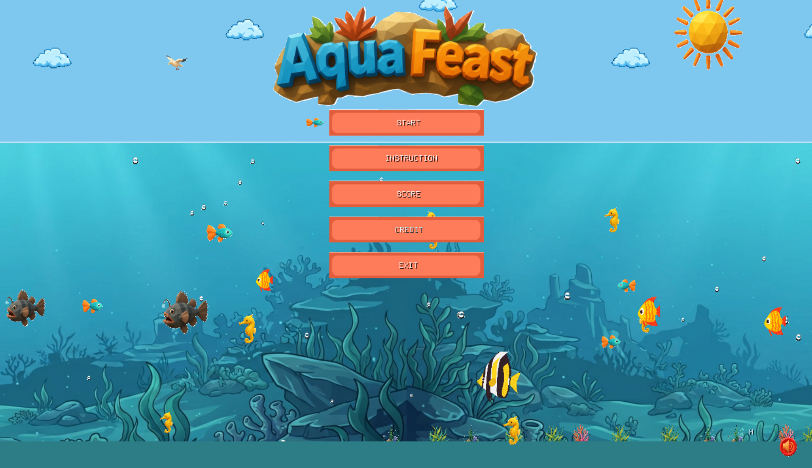
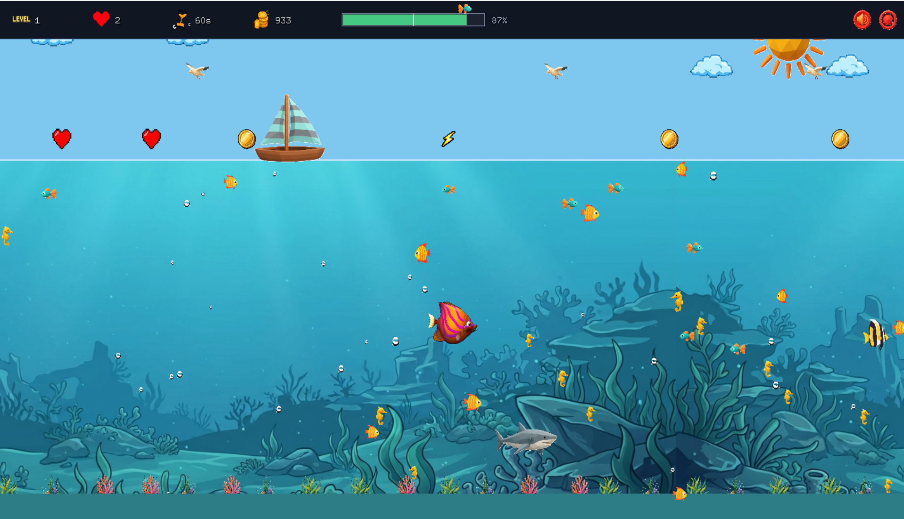
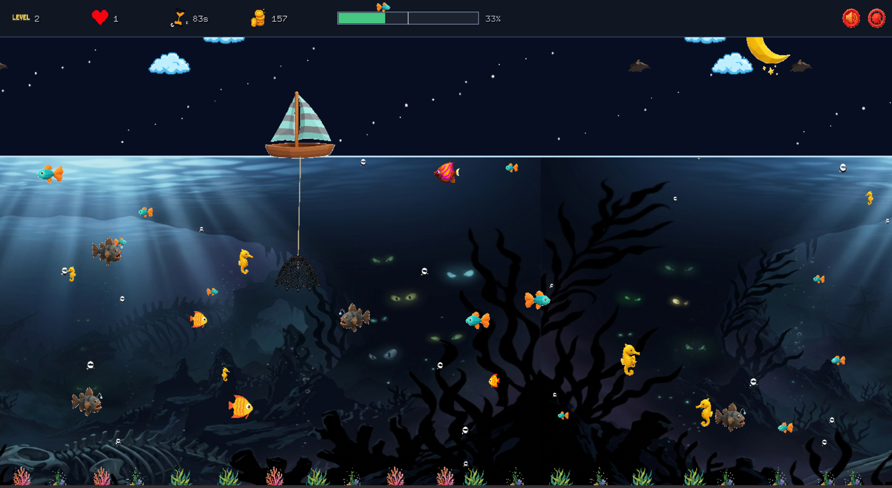
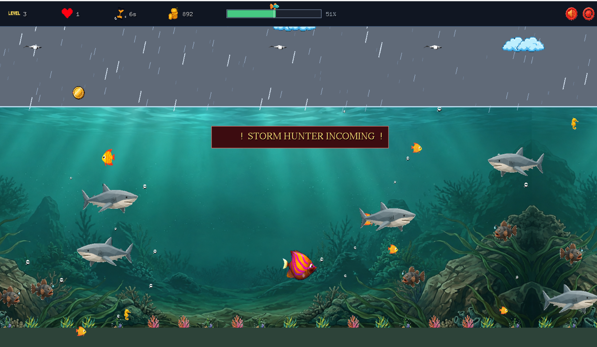

# AquaFeast

## Game Description

**AquaFeast** is a 2D "grow by eating" arcade game created using **C++** and the **iGraphics** library. The player controls a fish, eats smaller fish to grow, avoids larger predators, and progresses through three levels with increasing difficulty.

Level 3 introduces a special **hook mini-game**, where the player must tap `SPACE` to escape.

## Features

- Grow by eating smaller fish.
- Avoid larger predators and level-specific danger enemies.
- Three levels with changing environments: Sunny, Night, and Storm.
- Level 3 hook escape mini-game.
- Coins, power-ups, treasure, and other collectibles.
- HUD showing level, lives, time, score, and progress.
- Animated fish, bubbles, environmental effects, sound effects, and background music.
- Main menu, character selection, level map, score screen, help, credits, and end-of-run screens.

## Project Details

**IDE:** Visual Studio

**Language:** C++

**Graphics Library:** iGraphics

**Platform:** Windows PC (Win32/x86)

**Genre:** 2D Arcade Survival

## How to Run the Project

Make sure you have the following:

- **Visual Studio**
- **iGraphics Library** and the project dependencies included in this repository
- A Windows PC

### Run the Project

- Open the solution file (`test.sln`) in Visual Studio.
- Make sure the project is configured for **Win32/x86**.
- Build the solution.
- Run the program from Visual Studio.

The main gameplay code is routed through `iMain.cpp`, while the game systems are organized across the project header files.

## How to Play

### **Controls**

| Action | Keyboard / Mouse |
|---|---|
| Move Left | `A` / `←` |
| Move Right | `D` / `→` |
| Move Up | `W` / `↑` |
| Move Down | `S` / `↓` |
| Jump | `SPACE` |
| Hook Escape (Level 3) | Tap `SPACE` |
| Menu Up/Down | `↑` / `↓` or `W` / `S` |
| Select Menu Item | `ENTER` |
| Back | `BACKSPACE` |
| Mute | Mouse click |
| Restart | Mouse click |

## Game Rules

- Eat smaller fish to grow.
- Avoid larger predators.
- Collect available rewards and power-ups.
- Survive each level and continue to the next stage.
- In Level 3, escape the hook mini-game by tapping `SPACE` at the right time.
- The game tracks lives, time, score, and progress through the HUD.

## Project Structure

The project is organized into separate systems for:

- Player
- Fish entities and enemies
- Boat, nets, hook, and collectibles
- Environment and scrolling world
- HUD
- Level management
- Menus and other game screens
- Sound and score management

## Project Contributors

1. MD. SHAMSUL ALAM AIMAN
2. PUSHPENDU ROY RAJ
3. TIRTHA BARUA

## Screenshots

### **Main Menu**

### **Level 1 — Sunny Ocean**

### **Level 2 — Night Ocean**

### **Level 3 — Storm Ocean**

## Youtube Link

[Add your AquaFeast gameplay video link here](https://dub.sh/AquaFeast_Gameplay)

## Project Report

[Add your AquaFeast project report link here](https://dub.sh/AquaFeast_ProjectFolder)
